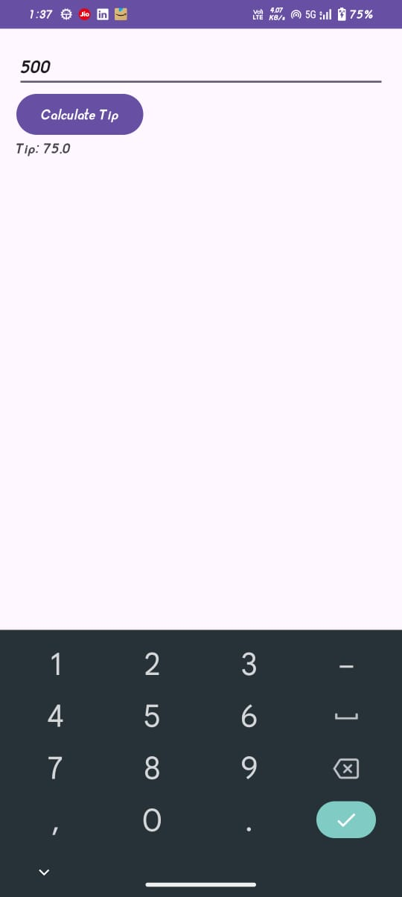

# 🧮 Tip Calculator App

A small Android app built to practice DataBinding + ViewModel concepts in MVVM architecture.

# ❓ Why this project?

To understand how DataBinding connects UI elements directly with a ViewModel, reducing boilerplate and making the app reactive.

# 🏗️ What does the app do?

Takes Bill Amount (₹/$).

Takes Tip %.

Calculates and displays:

Tip Amount

Total Amount

All updates happen instantly while typing, thanks to two-way DataBinding.

# 🔑 Which files are important?

MainActivity.kt → Sets up DataBinding and connects to TipViewModel.

TipViewModel.kt → Holds input (bill, percent) and performs calculation logic.

activity_main.xml → Uses <layout> tag with two-way binding (@={} syntax).

# ⚡ What I practiced here?

Setting up DataBinding in Android Studio.

Binding LiveData<String> / LiveData<Double> directly to UI.

Using @={} for two-way binding (EditText ↔ ViewModel).

Keeping UI state inside a ViewModel instead of Activity.

# 🧑‍💻 Tech Stack

Kotlin

MVVM (Model-View-ViewModel)

Android DataBinding

LiveData

# 🖼️ Sample UI
### INPUT

### OUTPUT

	
# 💡 Key Takeaway

This app may look tiny, but it demonstrates the power of DataBinding –
👉 UI automatically reacts to changes in the ViewModel, no need for findViewById or manual updates.

# 🚀 Next Steps

Add a “Round Tip” toggle.

Show currency symbols dynamically.

Experiment with View Binding vs DataBinding.
